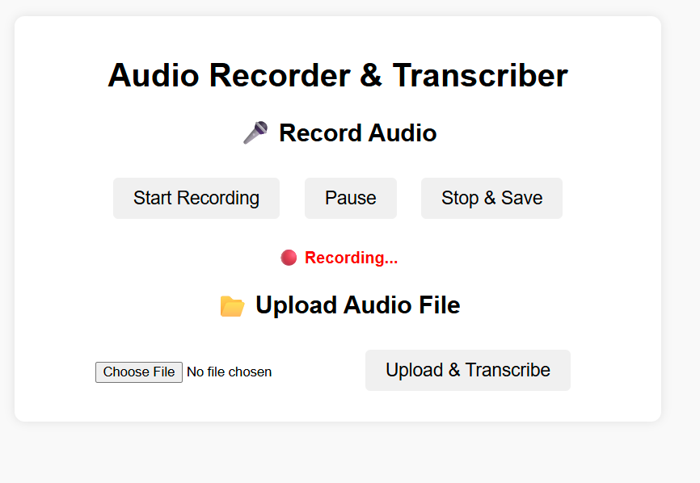

# EchoScribe

A versatile speech-to-text application that allows you to record audio and transcribe it into text through a clean web interface or directly from your command line.

## 📖 About The Project

EchoScribe is designed to be a simple yet powerful tool for anyone needing to quickly convert spoken words into written text. Whether you prefer a graphical user interface in your browser or the speed of a command-line tool, EchoScribe provides a seamless experience.

The project offers two primary modes of operation:
1.  A **Flask-based web server** that provides an easy-to-use recording and transcription page.
2.  A **command-line interface (CLI)** that allows for direct recording or launching the web server.

## ✨ Features

* **Dual-Mode Operation**: Use the intuitive web UI or the efficient CLI.
* **Web Interface**: A clean and simple interface for recording audio directly in your browser.
* **CLI Interface**: Quick access to recording functionality without opening a browser.
* **Audio Recording**: Captures audio from your microphone.
* **Automatic Transcription**: Saves the recording and automatically converts the speech to text.

## 🛠️ Getting Started

Follow these instructions to get a copy of the project up and running on your local machine.

### Prerequisites

You need to have Python installed on your system. You will also need `pip` to install the project dependencies.

### Installation

1.  **Clone the repository:**
    ```sh
    git clone [https://github.com/your-username/EchoScribe.git](https://github.com/your-username/EchoScribe.git)
    ```

2.  **Navigate to the project directory:**
    ```sh
    cd EchoScribe
    ```

3.  **Create and activate a virtual environment (recommended):**
    * On macOS/Linux:
        ```sh
        python3 -m venv venv
        source venv/bin/activate
        ```
    * On Windows:
        ```sh
        python -m venv venv
        .\venv\Scripts\activate
        ```

4.  **Install the required packages:**
    (Note: You should create a `requirements.txt` file listing all dependencies like Flask, SpeechRecognition, etc.)
    ```sh
    pip install -r requirements.txt
    ```

## 🚀 Usage

EchoScribe can be run in two ways.

### Method 1: Using the Web Interface Directly

This method starts the Flask web server, allowing you to use EchoScribe in your web browser.

1.  **Run the server file:**
    ```sh
    python server.py
    ```

2.  **Open your browser** and navigate to the following URL:
    ```
    [http://127.0.0.1:5000](http://127.0.0.1:5000)
    ```

3.  You will see the main page. Click the "Start Recording" button, grant microphone permission if prompted, and begin speaking.

4.  Once you are done, click "Stop Recording". The audio will be saved and transcribed, with the resulting text displayed on the page.

### Method 2: Using the Command-Line Runner (`vtt.py`)

This method gives you the choice to either launch the web server or record directly from the terminal.

1.  **Run the main script:**
    ```sh
    python vtt.py
    ```

2.  You will be presented with two options in your terminal.

    * **Option 1: Launch Web App**: Choosing this option will execute `server.py` for you, starting the web interface as described in Method 1.
    * **Option 2: Record in CLI**: Choosing this option will immediately start recording audio using your microphone directly in the command prompt. Speak your text, and the recording will stop after a period of silence. The transcribed text will then be printed directly to your terminal.

## 🖼️ Screenshots

<br>

**1. The Main Web Page**
*This is the initial screen when you launch the web application.*


<br>

**2. The Web Recorder Interface**
*This is how the page looks after you click "Start Recording".*


<br>

**3. The Command-Line (`vtt.py`) Options**
*This menu appears when you run the `vtt.py` script.*


## 🤝 Contributing

Contributions are what make the open-source community such an amazing place to learn, inspire, and create. Any contributions you make are **greatly appreciated**.

If you have a suggestion that would make this better, please fork the repo and create a pull request. You can also simply open an issue with the tag "enhancement".

1.  Fork the Project
2.  Create your Feature Branch (`git checkout -b feature/AmazingFeature`)
3.  Commit your Changes (`git commit -m 'Add some AmazingFeature'`)
4.  Push to the Branch (`git push origin feature/AmazingFeature`)
5.  Open a Pull Request

## 📄 License

Distributed under the MIT License. See `LICENSE` for more information.
